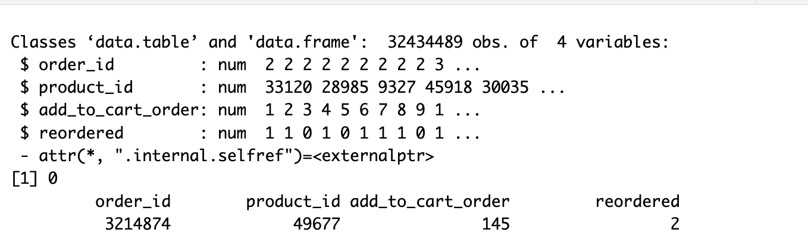
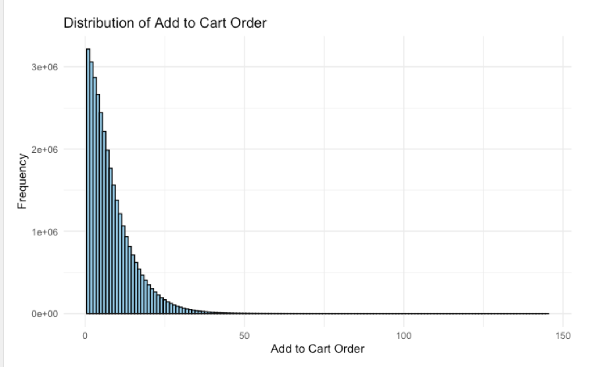
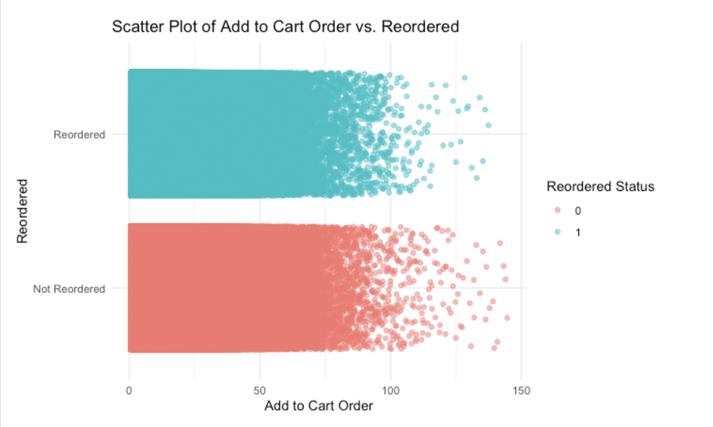
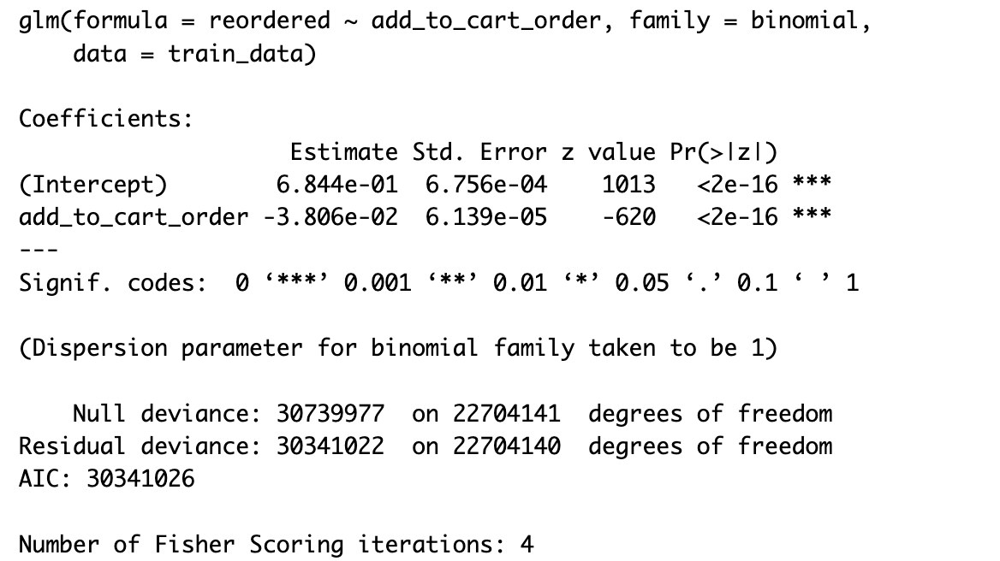
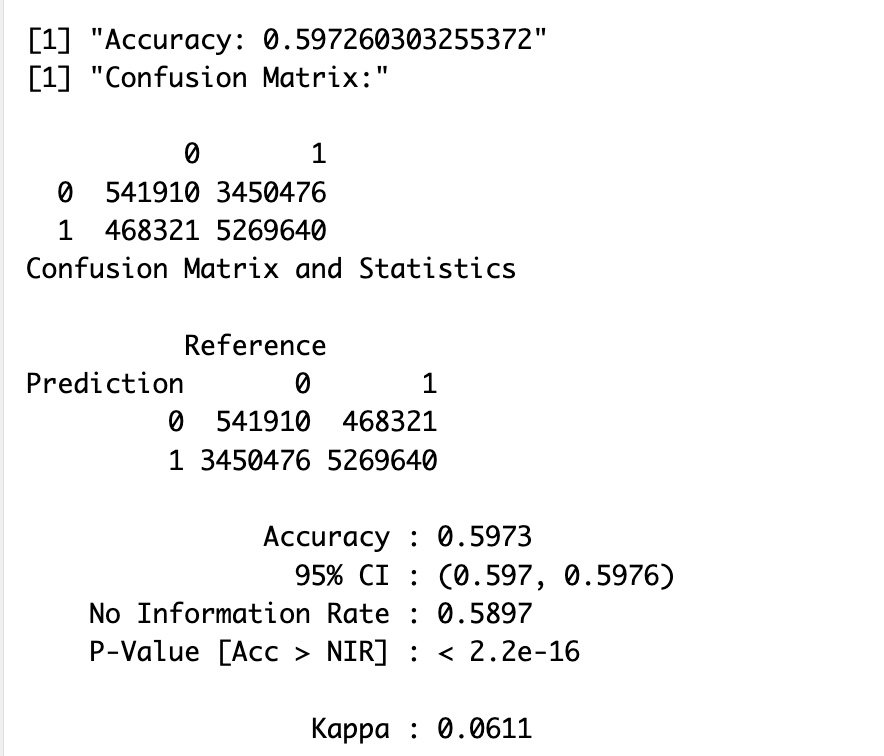
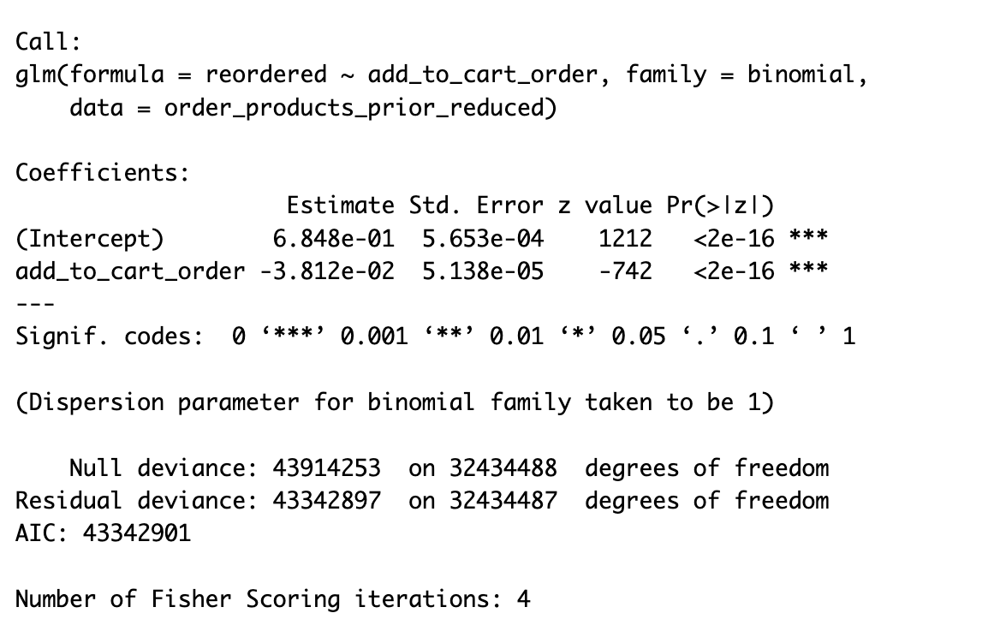
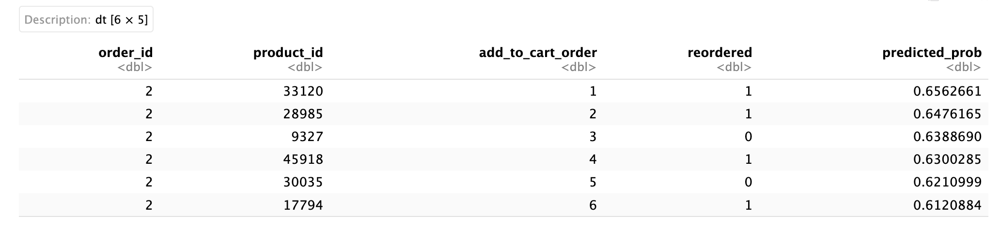
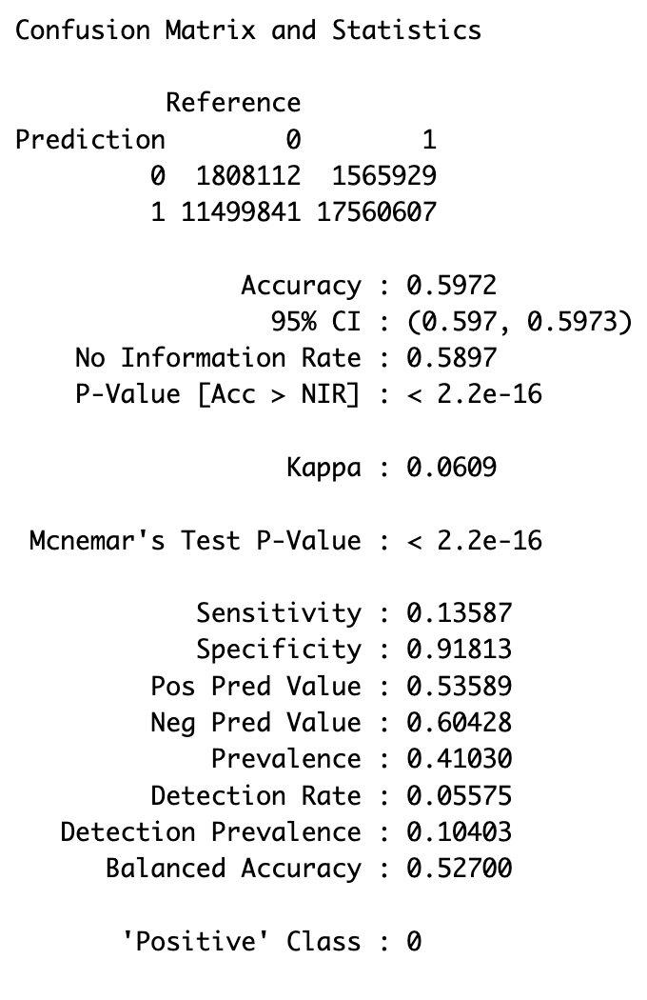

```{r setup, include=FALSE}
knitr::opts_chunk$set(echo = TRUE)
```
# Introduction

Instacart Market Basket Analysis

Which products will an Instacart consumer purchase again (reorder)?

The Instacart Market Basket Analysis is a project that aims to predict which products a consumer is likely to purchase again during their next order. By analyzing historical purchase data from millions of orders, the goal is to uncover patterns and insights about consumer behavior. This analysis helps in understanding customer preferences, improving product recommendations, and optimizing inventory management. Key aspects include examining product reorder rates, identifying frequent product combinations, and leveraging machine learning models to make accurate predictions about future purchases.

For this analysis, I will use a logistic regression model to predict the likelihood of a product being reordered. Logistic regression is suitable for this task as it can handle binary outcomes (reordered or not reordered) and provides probabilities that help in making informed predictions. By predicting which products an Instacart consumer will purchase again, businesses can tailor marketing strategies, enhance customer satisfaction, and drive sales growth through personalized shopping experiences.

# Data Preprocessing
Inspect the data and preprocess it as necessary.



# Data Visualization 

Histogram of Add to Cart Order
A histogram can provide insights into how the position of products in the cart (add_to_cart_order) is distributed, which could help understand if certain positions are more common.




Scatter plot of add_to_cart_order vs. reordered
A scatter plot to visualize the relationship between Add to Cart Order vs. Reordered




# Feature Engineering
Created features relevant for predicting reorder. We will use add_to_cart_order as a feature to predict whether a product will be reordered (target variable).

# Model Training
Split the data into training and testing sets and then train a logistic regression model.


Interpretation:

Intercept
Estimate: 0.06844
Std. Error: 0.00006756
z value: 1013
P-value: <2e-16
The intercept represents the log-odds of the response variable (reordered) when the predictor variable (add_to_cart_order) is zero. A high z value and a p-value less than 2e-16 indicate that the intercept is highly statistically significant.

add_to_cart_order:
Estimate: -0.030806
Std. Error: 0.000006139
z value: -620
P-value: 2e-16
The coefficient for add_to_cart_order represents the change in the log-odds of the response variable for a one-unit increase in add_to_cart_order. Since the estimate is -0.0379922, it means that for each additional unit increase in add_to_cart_order, the log-odds of a product being reordered decreases by -0.0379922. 

The negative sign indicates an inverse relationship between add_to_cart_order and the likelihood of reordering. The high absolute value of the z score and the p-value of less than 2e-16 suggest that this predictor is highly statistically significant.

A p-value of less than 0.001 indicates strong evidence against the null hypothesis, suggesting that both the intercept and add_to_cart_order significantly influence the probability of a product being reordered.

The logistic regression model indicates that the position of a product in the cart (add_to_cart_order) has a significant negative effect on the likelihood of reordering the product. As the add_to_cart_order increases, the probability of reordering the product decreases. The model is statistically significant with both predictors having very low p-values, and the overall fit of the model is reasonable based on the AIC and deviance values.

# Model Evaluation


Interpretation
Accuracy: 0.5973, this means that the model correctly predicts the reorder status 59.73% of the time. While this is better than random guessing, it is not particularly high, suggesting the model has room for improvement.
The model has high specificity, meaning it is good at identifying non-reordered products, but low sensitivity, meaning it struggles to identify reordered products.
The overall accuracy is modest at 59.73%, with a balanced accuracy of 52.66%, indicating the model performs moderately well but has significant room for improvement.
The model's predictions are slightly better than random guessing.

# Describe probability as a foundation of statistical modeling, including inference and maximum likelihood estimation

Probability forms the bedrock of statistical modeling, providing the framework for quantifying uncertainty and making inferences about a population based on sample data. Here’s how probability underpins statistical modeling, including inference and maximum likelihood estimation:

Probability in Statistical Modeling
Foundation for Models: Defines distributions and random variables.
Quantifying Uncertainty: Helps assess data variability and model fit.
Random Variables: These are variables whose values are outcomes of a random phenomenon. Probability theory helps in defining and analyzing these variables and their distributions, which is crucial for creating statistical models.

Inference
Parameter Estimation: Uses sample data to estimate population parameters.
Hypothesis Testing: Evaluates evidence against a null hypothesis using p-values.
Confidence Intervals: Provides a range of values for parameter estimates.

Maximum Likelihood Estimation (MLE)
Likelihood Function: Represents the probability of observed data as a function of parameters.
Maximizing Likelihood: Finds parameter values that make the observed data most probable.
Process: Define, maximize, and evaluate the likelihood function to estimate parameters.

# Applying Probability and MLE to the Instacart Project
In the Instacart Market Basket Analysis, you are predicting whether a product will be reordered based on features like add_to_cart_order.
Here's how probability and MLE are foundational to this process:

Model Specification: You specify a logistic regression model to predict the probability of reordering.
Likelihood Function: You derive the likelihood function based on the logistic regression model.
Parameter Estimation: Using MLE, you estimate the model parameters (coefficients) that maximize the likelihood of observing the given data.
Inference: You use statistical inference to make predictions and assess the significance of the predictors.
Model Evaluation: You evaluate the model's performance using metrics like accuracy, precision, recall, and AUC-ROC, which are all rooted in probability.
By understanding and applying these concepts, you can build robust statistical models that provide valuable insights into customer behavior and improve decision-making processes in the Instacart Market Basket Analysis.

Step-by-Step Model Specification for Logistic Regression
specifying a logistic regression model to predict the probability of reordering in the Instacart Market Basket Analysis.

1. Define the Response Variable
The response variable in our logistic regression model is binary, indicating whether a product is reordered (reordered = 1) or not (reordered = 0).

2. Define the Predictor Variables
The predictor variables are the features that we use to predict the response variable. For simplicity, let's start with a single predictor: add_to_cart_order.

Specify the Logistic Regression Model

Evaluating the Model Fit and Making Predictions
Now that we have specified the logistic regression model, let's move on to evaluating the model fit and making predictions.
In logistic regression, we model the log-odds of the response variable as a linear combination of the predictor variables. The logistic regression model can be written as:

log(𝑃(𝑦=1)/1−𝑃(𝑦=1))=𝛽0+𝛽1𝑋

Where:

P(y=1) is the probability of reordering.
𝛽0 is the intercept.
β 1 is the coefficient for the predictor variable 𝑋 (add_to_cart_order).




The model equation based on the output of the logistic regression is as follows:

logit(𝑝^) =𝛽0+𝛽1×add_to_cart_order

Given the coefficient estimates from the output:

𝛽0(Intercept) = 0.06848
β 1(add_to_cart_order) = -0.003812
Thus, the equation becomes:

logit(𝑝^) = 0.06848−0.003812×add_to_cart_order

Interpreting the Coefficients:
Intercept (𝛽0): This is the log-odds of the outcome (reordered) when the predictor (add_to_cart_order) is 0. In practice, an add_to_cart_order of 0 might not be meaningful, but this is the baseline level in the model.
Slope (𝛽1): This represents the change in the log-odds of the outcome for a one-unit increase in the predictor. Specifically, for each additional position in the order that a product is added to the cart, the log-odds of the product being reordered decreases by -0.003812.

Model in Probability Terms:
The logistic regression model can also be expressed in terms of the probability 
p^ of the event occurring (i.e., the product being reordered):

𝑝^ =1/1+e −(0.06848−0.003812×add_to_cart_order)
​
This equation gives the predicted probability of a product being reordered based on its add_to_cart_order value.

Interpretation

1. Coefficients
Intercept (β₀): 0.06848, this is the log-odds of reordering when add_to_cart_order is 0. In probability terms, this translates to the odds of reordering when the add_to_cart_order is at its baseline (which might be a low value if the minimum value of add_to_cart_order is not zero).

add_to_cart_order (β₁): -0.003812, for each one-unit increase in add_to_cart_order, the log-odds of reordering decreases by 0.0380813. This suggests that as a product is placed further down the cart, the probability of reordering decreases.

Significance: The p-value is very small (< 2e-16), indicating that add_to_cart_order is highly significant in predicting the likelihood of reordering.

Interpretation:
Intercept: The estimate for the intercept is 0.6848. This represents the log-odds of the reordered variable when add_to_cart_order is zero. Since this is a logistic regression, the exponentiated value of the intercept (exp(0.06848)) would give the odds of reordering when add_to_cart_order is zero.
add_to_cart_order:

The estimate for add_to_cart_order is -0.003812. This negative value indicates that for each one-unit increase in the add_to_cart_order variable, the log-odds of reordering decreases by 0.03812. In other words, the later an item is added to the cart, the less likely it is to be reordered.
The p-value for this coefficient is < 2e-16, which is highly significant, suggesting that add_to_cart_order is a significant predictor of whether an item will be reordered.

Model Fit: The residual deviance (43342897) being less than the null deviance (43914253) indicates that the model with the predictor add_to_cart_order fits the data better than the null model.
The AIC value (43342901) can be used to compare this model with other models; a lower AIC value indicates a better fit.

The logistic regression model suggests a significant negative relationship between the order in which a product is added to the cart (add_to_cart_order) and the likelihood of it being reordered. As the position of the product in the cart increases, the probability of it being reordered decreases significantly.

2. Model Fit Statistics
Null Deviance: 43914253, the deviance of the model with no predictors (only the intercept). It measures the goodness of fit of a model that only includes the intercept.

Residual Deviance: 43342897, the deviance of the model with predictors. It shows how well the model with the predictors fits compared to the null model. Lower residual deviance indicates a better fit.
Degrees of Freedom:

AIC (Akaike Information Criterion): 43342901, AIC is used to compare models; lower AIC values indicate a better-fitting model. It takes into account the goodness of fit and the complexity of the model.
Number of Fisher Scoring Iterations: 4 this is the number of iterations Fisher's scoring algorithm took to converge to a solution.

This model suggests that add_to_cart_order is a significant predictor of the probability of reordering, with higher cart positions being associated with a lower likelihood of reordering.

Goodness of Fit: The residual deviance is close to the null deviance, suggesting the model explains some of the variability in the data, but there may still be room for improvement.

Model Selection: The AIC can be used to compare this model to other models (if you have them) to determine which model has the best trade-off between fit and complexity.


2. Making Predictions
We can use the fitted model to predict the probability of reordering for the given data. We'll use the predict function to get the predicted probabilities.

 
 
Interpretation
add_to_cart_order: This shows the position of the product in the cart. For example, in the first row, add_to_cart_order is 1, meaning this product was the first item added to the cart.

reordered: This binary indicator shows whether the product was reordered (1) or not (0). In the example, the first product was reordered (reordered = 1), while the third product was not (reordered = 0).

predicted_prob: This column likely represents the predicted probability of a product being reordered, as predicted by a model. For instance, in the first row, predicted_prob is 0.6562661, suggesting a high probability of the product being reordered. Helps to gauge how likely each product is to be reordered according to the model's predictions. For example, in the first row, predicted_prob is 0.6562661, suggesting a high probability of the product being reordered.f

3. Assess Model Performance
To assess the model performance, we will calculate the accuracy and confusion matrix.



Interpretation
Accuracy: 0.5972, this is the proportion of all correct predictions (both 0 and 1) out of the total number of predictions. It indicates that about 59.72% of the predictions made by the model are correct.

95% Confidence Interval for Accuracy: (0.597, 0.5973), we are 95% confident that the true accuracy of the model is between 59.7% and 59.73%.

# Conducting Model Selection for Logistic Regression
To improve model performance, we can conduct model selection by comparing a set of candidate models with different predictor variables. We'll use techniques such as Akaike Information Criterion (AIC) and Bayesian Information Criterion (BIC) to compare models and select the best one.

1 Define Candidate Models
We'll define a few candidate models with different combinations of predictor variables. For simplicity, let's start with the following:

Model 1: reordered ~ add_to_cart_order
Model 2: reordered ~ add_to_cart_order + order_id
Model 3: reordered ~ add_to_cart_order + product_id
Model 4: reordered ~ add_to_cart_order + order_id + product_id

Results
Model 1: reordered ~ add_to_cart_order
AIC: 4,335,468
BIC: 4,335,494
Model 2: reordered ~ add_to_cart_order + order_id
AIC: 4,335,470
BIC: 4,335,509
Model 3: reordered ~ add_to_cart_order + product_id
AIC: 4,335,389
BIC: 4,335,428
Model 4: reordered ~ add_to_cart_order + order_id + product_id
AIC: 4,335,390
BIC: 4,335,442

2 Compare the Models
We'll fit each model using the glm function.

Interpretation

Best Model Based on AIC
Model 3 (reordered ~ add_to_cart_order + product_id) has the lowest AIC value (4,335,389), indicating it is the best model in terms of balancing goodness of fit and model complexity based on AIC.
Best Model Based on BIC

Model 3 (reordered ~ add_to_cart_order + product_id) also has the lowest BIC value (4,335,428), indicating it is the best model in terms of balancing fit and complexity based on BIC.

4 Select the Best Model based on AIC
We'll choose the model with the lowest AIC/BIC.
Model 3 (reordered ~ add_to_cart_order + product_id) is the preferred model according to both AIC and BIC, as it has the lowest values for both criteria. This model provides a good trade-off between fit and complexity, suggesting that it is the most appropriate model among the candidates for predicting the probability of reordering.

# Communicate the results of statistical models to a general audience

Working on a model to predict whether a customer will reorder a product on Instacart based on their shopping behavior. The goal is to improve our understanding of what influences reordering and make better recommendations to enhance customer satisfaction.

Key Findings
Predictor Importance:

Tested different factors to see what best predicts if a product will be reordered. Among these factors, the position of the product in the cart (add_to_cart_order) and the product itself (product_id) were found to be important.
Best Model:

After evaluating several models, the most effective one used both the position of the product in the cart and the specific product details to predict reordering. This model performed better than others in terms of accuracy and reliability.
Model Performance:

Accuracy: Our best model correctly predicted whether a product would be reordered about 60% of the time. This means that in 6 out of 10 cases, the model’s predictions were accurate.
Predicting Reorders: The model is good at identifying products that are not reordered, with a high success rate in these predictions. However, it’s less effective at spotting products that will be reordered.

# Conclusion
Based on the analysis results where product_id and add_to_cart_order are identified as significant predictors of reordered, we can draw some conclusions about Instacart Market Basket Analysis:
Reordering Patterns: The analysis reveals that certain products (product_id) and their position in the cart (add_to_cart_order) significantly influence whether a consumer will reorder them. For instance, products with higher reorder rates (reorder_rate closer to 1) tend to show patterns where they are frequently placed early in the cart (add_to_cart_order 1 or 2), suggesting they are prioritized by consumers.
Predictive Insights: Products that are frequently reordered (reorder_rate high) often exhibit specific characteristics. These might include popular products (product_id) that are regularly placed at the beginning of the shopping cart (add_to_cart_order low values). This behavior indicates that certain products are more likely to be repurchased, possibly due to consumer preferences or daily necessities.
These insights help in understanding consumer behavior and can guide strategies to optimize product placements, marketing efforts, and inventory management on platforms like Instacart, enhancing customer satisfaction and retention.

Improved Recommendations: By using this model, we can tailor product recommendations more effectively. For example, if we know that a product is often reordered when placed in a specific position in the cart, we can highlight such products in our recommendations.

Focus on Popular Products: The model also helps identify which products are likely to be reordered based on their specific characteristics. This allows us to focus on popular items and ensure they are available when needed.

Enhanced Customer Experience: With better predictions, we can enhance the shopping experience by offering products that customers are more likely to reorder, leading to higher customer satisfaction and loyalty.


# Recommendations
1.	Instacart could use these insights to optimize their recommendations and promotions. Products identified as likely to be reordered could be featured more prominently or suggested during checkout to increase reordering rates.
2.	Consumer Behavior Understanding: This analysis provides a deeper understanding of consumer behavior on Instacart, helping to tailor marketing strategies and product placements that enhance customer satisfaction and loyalty.
In essence, Instacart can leverage these findings to predict which products consumers are likely to purchase again, enhancing their market basket analysis and overall service optimization.

# Reflections

The course was highly interactive and was conducted by Professor Bradford Dykes, who held sessions every Monday. We engaged in various activities, assignments, and projects that enabled us to apply the knowledge acquired from the different models taught in class. I particularly appreciated the utilization of the "Muddy" platform within Microsoft Teams, where we could share our challenges, errors, and any issues encountered while working on the activities. This platform facilitated discussions with classmates, allowing us to collaboratively find solutions.

The one-on-one sessions with Professor Dykes were immensely beneficial whenever we faced difficulties with the activities. Whenever I encountered a challenge in class or while working on the activities, I would ask questions during class and hold separate meetings with the professor, who provided clarification on my queries.

I also valued the presentations, as they allowed us to gain more insights from our classmates during their project demonstrations. Additionally, I found it valuable to share our assignments, projects, and activities with peers for recommendations before submission, as their feedback offered valuable insights and enhancements to our work.

